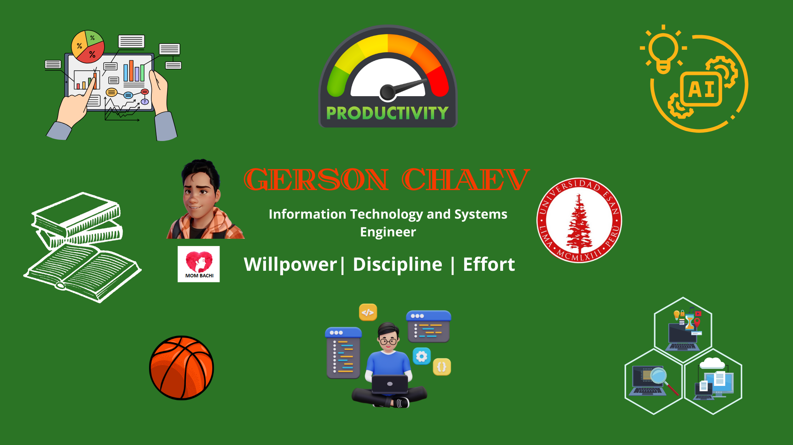

<h1 align="center">Hi 👋, I'm <a href="https://www.linkedin.com/in/gersonchaev">Gerson</a></h1>

 
<h3 align="left">Languages and Tools:</h3>

          

🌱 I’m currently learning **Deep Learning**

## 👨🏻‍💻 &nbsp;Sobre mi
<!--👨‍💻 &nbsp;I'm Currently Working at \-->
💡 &nbsp;I like to explore new technologies and develop IT solutions and data.\
🎓 &nbsp;I'm currently studying Information Technology and Systems Engineering at ESAN University.\
🌱 &nbsp;I am on my way to learn more about Machine Learning, Deep Learning and Cloud Computing.\
✍️ &nbsp;In my free time, I spend my time learning new things about my career, reading books and writing verses about my day to day life.
 

## *Proyectos*
<table>
<tr>
    <td width="50%">
      <h3 align="center">Imputación de datos perdidos</h3>
      

        <a href="https://gersonevangelista.github.io/imputacion_data_perdida/Imputacion_datos_perdidos.html">Proyecto 1</a>
      
                                                                                    
    </td>

  <td width="50%">
   
    <h3 align="center">Validación y Balanceo de los datos</h3>
    
                                       
      <a href="https://gersonevangelista.github.io/Validacion_Balanceo_data/Validacion_Balanceo_de_Datos.html">Proyecto 2</a>
    

     
  </td>
</tr>

<tr>
<td width="50%">
   
    <h3 align="center">Bank_Personal_Loan_Modelling (Machine Learning) en R</h3>
    
                                       
      <a href="https://gersonevangelista.github.io/Bank_Personal_Loan_Modelling_GCE/Bank_Personal_Loan_Modelling.html">Proyecto 3</a>
    

     
  </td>
</tr>

</table>                                                                                 
 

### ⚙️ &nbsp;GitHub Analytics

  

<h3 align="left">Connect with me:</h3>

  
  
  

 
